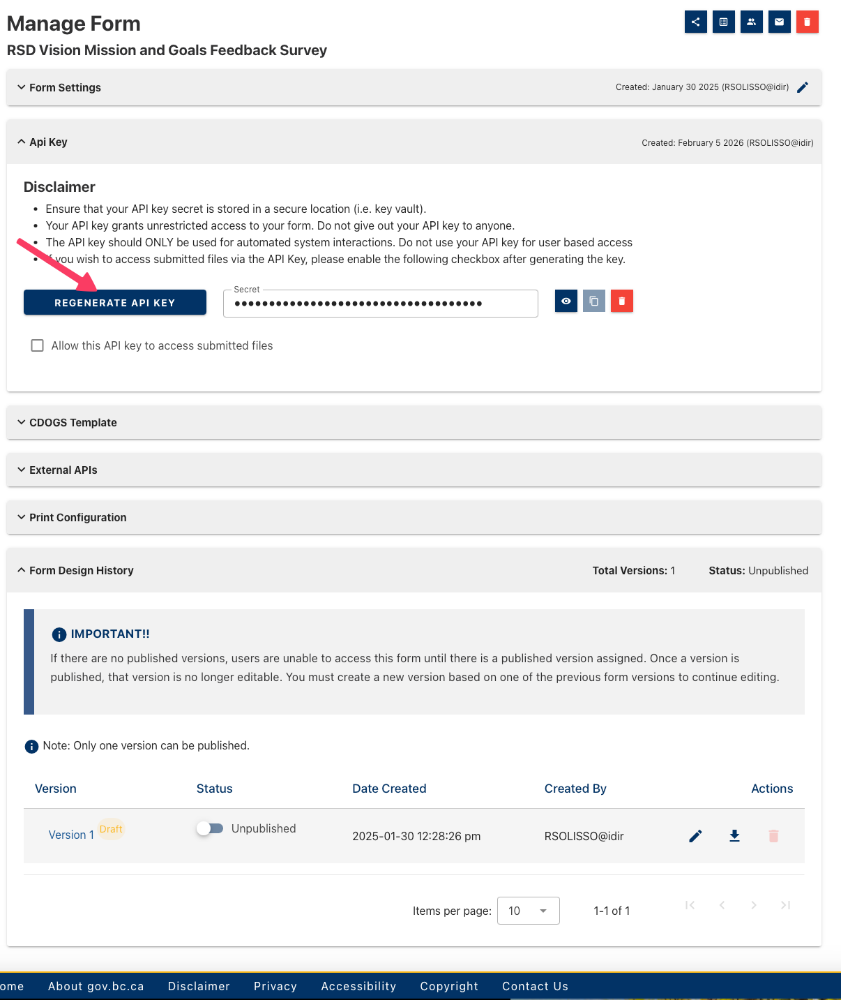

# FormIOr Cheat Sheet (Core + Extras)

Last updated: 2026-02-05

This cheat sheet is a quick, one-page style reference inspired by the ggplot2
cheat sheet. It focuses on the most common workflow plus key helper functions.

---

## Core Workflow (Most Common Path)

**Goal:** Download -> Flatten -> Clean -> Diagnose -> Export


### CHEF Credentials (Quick Visual)

API key and Form ID are in the form’s **Manage** page.  
Form ID is the alphanumeric code after `=` in the Manage page URL.




**Default CHEF base URL:**  
`https://submit.digital.gov.bc.ca/app/api/v1`

```
┌────────────────────────────────────────────────────────────────────┐
│ CHEF credentials                                                     │
│ - Manage page -> API key                                             │
│ - URL after “=” -> Form ID                                           │
│ - Default base URL: https://submit.digital.gov.bc.ca/app/api/v1      │
└────────────────────────────────────────────────────────────────────┘
```

### Core Steps

```
┌────────────────────────────────────────────────────────────────────┐
│ Core Steps: Download -> Flatten -> Clean -> Diagnose -> Export       │
└────────────────────────────────────────────────────────────────────┘
```

1. **Download responses**
```r
raw <- GetResponses(form_id = "YOUR_FORM_ID")
```

2. **Flatten nested responses**
```r
flat_raw <- FlattenSubmissions(raw)
```

3. **Normalize column names (recommended)**
```r
norm <- NormalizeColumnNames(flat_raw, return_flat = TRUE)
flat <- norm$flat
```

4. **Deduplicate (optional)**
```r
dedup <- DeduplicateSubmissions(flat, id_col = "form_submissionid", return_flat = TRUE)
flat <- dedup$flat
```

5. **Resolve repeated answers (optional)**
```r
resolved <- ResolveRepeats(flat, id_col = "form_submissionid", return_flat = TRUE)
flat <- resolved$flat
```

6. **Create a codebook**
```r
codebook <- MakeCodebook(flat)
# Optional: include labels from the form schema
# form_meta <- GetFormMetadata(form_id = "your-form-id", api_key = "your-api-key")
# codebook <- MakeCodebook(flat, form = form_meta, include = "all")
```

7. **Run quick diagnostics**
```r
summary_age <- SummaryByField(flat, field = "age")
PlotHistogram(flat, "age")
PlotBarSummary(flat, "program")
```

8. **Export to Excel**
```r
sheets <- list(
  Raw_Flattened = flat_raw$FlatResponses,
  Cleaned_Data = flat$FlatResponses,
  Codebook = codebook,
  Summary_Age = summary_age$summary
)
ExportToExcel(sheets, path = "FormIOr_output.xlsx", overwrite = TRUE)
```

---

## Helpful Extras (Common Add-Ons)


### Logging and Fixes

```
┌────────────────────────────────────────────────────────────────────┐
│ Logging and Fixes                                                    │
│ - StartAuditLog / WriteAuditLog / StopAuditLog                       │
│ - AdjustSubmissions for targeted edits                               │
└────────────────────────────────────────────────────────────────────┘
```

**Audit logging (highly recommended)**
```r
StartAuditLog("audit_log.csv")
WriteAuditLog("flatten", details = "Flattened submissions")
StopAuditLog()
```

**Targeted adjustments**
```r
updates <- data.frame(
  id = "sub_020",
  column = "region",
  value = "North",
  stringsAsFactors = FALSE
)

flat <- AdjustSubmissions(
  flat,
  id_col = "form_submissionid",
  delete_ids = c("sub_001", "sub_017"),
  updates = updates,
  return_flat = TRUE
)
```

### Cleaning Helpers

```
┌────────────────────────────────────────────────────────────────────┐
│ Cleaning Helpers                                                     │
│ - CompactSelections for multi-select fields                          │
│ - RenameCols for clear column names                                  │
└────────────────────────────────────────────────────────────────────┘
```

**Compact multi-select columns**
```r
flat <- CompactSelections(flat)
# Optional: change the separator used to detect checkbox groups
# flat <- CompactSelections(flat, sep = "-")
```

**Rename columns**
```r
rename_map <- c("old_name" = "new_name")
flat <- RenameCols(flat, rename_map = rename_map)
```

### Diagnostics

```
┌────────────────────────────────────────────────────────────────────┐
│ Diagnostics                                                         │
│ - CrossTab for quick relationships                                  │
│ - ResponseTimeline for trends over time                              │
└────────────────────────────────────────────────────────────────────┘
```

**Cross-tab summaries**
```r
CrossTab(flat, row = "region", col = "program")
```

**Response timelines**
```r
ResponseTimeline(flat, date_col = "created")
PlotResponseTimeline(flat, date_col = "created")
```

---

## Wizard (Automated Workflow)

If you want a guided, repeatable workflow with prompts:
```r
out <- FormIOrWorkflow()
```

This will:
- create an output folder
- start or reuse an audit log
- download, flatten, clean, diagnose, and export
- save a plan so you can replay the workflow later

---

## Quick Reference: Key Functions

**Download**
- `GetResponses()`
- `GetSubmissions()`
- `GetFormMetadata()`

**Flatten & Clean**
- `FlattenSubmissions()`
- `NormalizeColumnNames()`
- `DeduplicateSubmissions()`
- `ResolveRepeats()`
- `CompactSelections()`
- `AdjustSubmissions()`

**Diagnostics**
- `MakeCodebook()`
- `SummaryByField()`
- `CrossTab()`
- `PlotHistogram()`
- `PlotBarSummary()`
- `PlotWordcloud()`
- `PlotResponseTimeline()`

**Export & Logging**
- `ExportToExcel()`
- `StartAuditLog()`
- `WriteAuditLog()`
- `StopAuditLog()`

---

## Where to Learn More

- Full handbook: `inst/extdata/handbook/index.md`
- Function pages: `inst/extdata/handbook/functions/`
- Wizard pages: `inst/extdata/handbook/wizard/`
